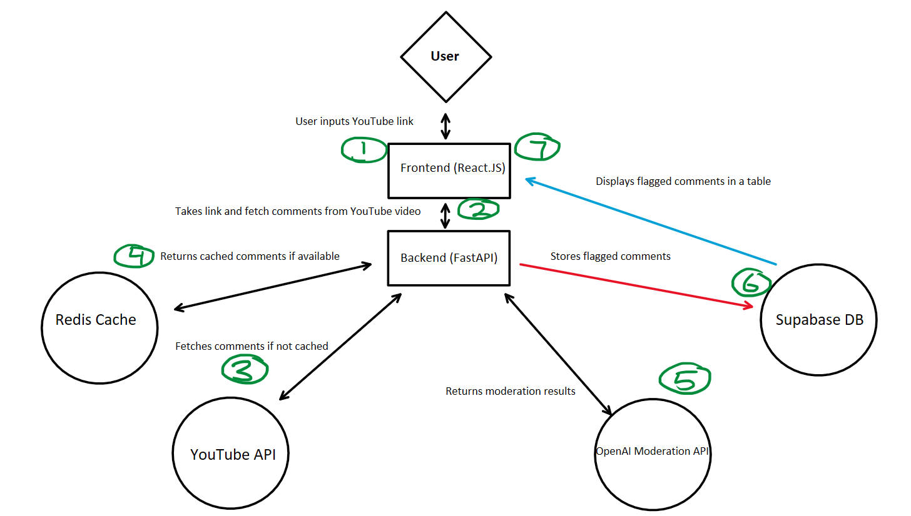

# AegisAI 

## Introduction :wave:
AegisAI is a web application that streamlines moderating YouTube comments by flagging toxic and harmful comments 
with just a YouTube link. Users can help make YouTube a safer community, by reporting flagged comments.

## Table of Contents :scroll:
- [Inspiration](#inspiration)
- [Tech Stack](#tech-stack)
- [Architecture](#architecture)
- [Getting Started](#getting-started)
- [Features](#features)
- [APIs](#apis)
- [Future of AegisAI](#future-of-aegisai)
- [Author](#author)

## Inspiration :sparkles:
Scrolling through social media, I was excited that a K-Pop group called LE SSERAFIM, was going to release their latest mini album, EASY. After the release of the album and the 'EASY' music video, it quickly became one of my favorite albums of 2024. Little did I know that there was a storm coming. 

After LE SSERAFIM's stage at Coachella 2024, they received a lot of criticism for poor vocal perfomance. 
It eventually led to a massive hate train on various social media platforms. Several weeks later, the hate train got 
progressively worse. That's when LE SSERAFIM disabled their comment sections for their social media platforms. 
Besides LE SSERAFIM, there are numerous K-Pop groups that also receive toxic or harmful comments. 
I started brainstorming if there was something I can do to reduce the amount of toxic and harmful comments, and 
that ultimately led me to AegisAI. I wanted to create a safer digital space where celebrities, content creators, brands/businesses, community members, and etc. are shielded from toxic and harmful comments.

## Tech Stack :wrench:

### Languages:
- HTML
- CSS
- JS
- Python

### Frameworks:
- React.js
- MaterialUI
- FastAPI

### Technologies/Tools:
- Git
- Docker
- Redis
- Supabase

## Architecture :computer:

## Getting started (In-Progress) :rocket:
- Walk user through running code on their machine

## Features (In-Progress) :clipboard:
- What features are there?
- Moderation of YouTube comments
- Can insert either a shorts or regular video

## APIs (In-Progress) :ledger:
- Moderation API
- YouTube data v3
- What calls can be seen in main.py

## Future of AegisAI (In-Progress) :hammer:
- Future improvements/plans?

## Author (In-Progress) :panda_face:
- Thank you
- Insert a small About Me

## Updates/Tasks/Timeline :calendar:

### 2/2/25
- [x] Task 1: Start Repository
- [x] Task 2: Create React-app
- [x] Task 3: Setup basic frontend

### 2/3/25
- [x] Task 1: Setup API keys
- [x] Task 2: Test API keys
    - FastAPI wasn't working properly
    - Realized OpenAI's Moderation API changed and had to account for the new updates
- [x] Task 3: Test initial backend code
    - API not return desired results
    - Receiving errors regarding the data types being passed in
        - Fixed by modifying comments, moderation, and database files in the backend to provide and process the right data types

### 2/4/25
- [x] Task 1: Test flagged comments storage in Supabase
    - Ran into weird error with Python and Pylance extension
        - Fixed by downgrading Python and Pylance extension to 2023 version
    - Ran  into another error where `flagged comments` is not a list! Received: []
    - Issue with database.py while inserting the comments into Supabase
        - Misspelled the columns, so the `store_comments` inside database.py was trying to insert the `flagged_comments` in non-existing columns in Supabase

- [x] Task 2: Implement caching (backend optimization)
    - Issue with Redis not installing properly
        - Managed to proceed with project without the above issue impacting testing
        - Moved to using Docker for running backend for testing
        - To run docker:
            - docker-compose -d build
        - To shut down:
            - docker-compose down
    - Implemented testing to see if there is any major improvements using Redis for caching
        - TLDR; A very small perfomance boost for running the same Youtube link through the OpenAI Moderation API
        - Might be an issue with the moderation.py code, will have to come back to this later
        
- [] Task 3: Attach frontend to backend
    - Didn't get to this step, but will work on this tomorrow

### 2/5/25
- [x] Task 1: Attach frontend to backend
    - Experienced issues with connecting to the API from the frontend
        - Backend was working fine, but had to connect to LocalHost8000 to utilize the backend logic from the Frontend side
    - Next ran into issues with not being able to display the table of flagged comments
        - Later got fixed, by updating `handleSubmit` inside the Home.js file
    - Another issue where the usernames of the Authors of the flagged comments aren't being displayed on the table
        - Later fixed by changing what data was being accessed from `author` to `id`
            - `<TableCell>{comment?.author || "Unknown"}</TableCell>` -> `<TableCell>{comment?.id || "Unknown"}</TableCell>`
- [] Task 2: Improve design of frontend
    - Didn't get to this task, will work on this on 2/6/25 

### 2/6/25
- [x] Task 1: Improve design of frontend
    - Take inspiration from Mobbin and create home page
    - Ran into an issue with react-infinite-scroll-component not loading properly
        - Had to ensure it was installed, and then manually input the package into the package.json file
    - Will continue to work on frontend tomorrow

### 2/7/25
- [x] Task 1: Improve design of frontend pt2
    - Add navigation bar

### 2/8/25
- [] Task 1: Add report button
- [] Task 2: Optimize moderation backend

- Didn't work on AegisAI on 2/8/25

### 2/9/25
- [x] Task 1: Add report on YouTube button
    - Ran into issue with fetching the correct commentID and the videoURL to send the link to the comment the user wants to report
        - Solution was to create two new columns inside Supabase's tables
        - Afterwards modify the backend to be able to fetch the both the `comment_id` and `video_id` of the flagged comments
        - Then go back to frontend to modify the `generateYouTubeCommentLink` function to create the YouTube link that we will link as the href for the "Report on YouTube" button
        - Additionally within the table, we needed to specify that we want each button to have the correct YouTube link that highlights the comment the user wants to report attached to the button

### 2/10/25
- [x] Task 1: Optimize moderation backend
    - Increased minimum amount for batching comments to be sent to OpenAI's Moderation API. Reducing the amount of times the API is called
    - Additionally decrease the time delay that was previously implemented (from 2 to 1)
        - The time delay was used to  reduce the risk of the API throttling
- [] Task 2: Test the performance increase from using Redis caching
    - Ran into a connection error with the Redis server
        - Currently don't have a solution to this error as of 2/10/25

# Future improvements
- 
